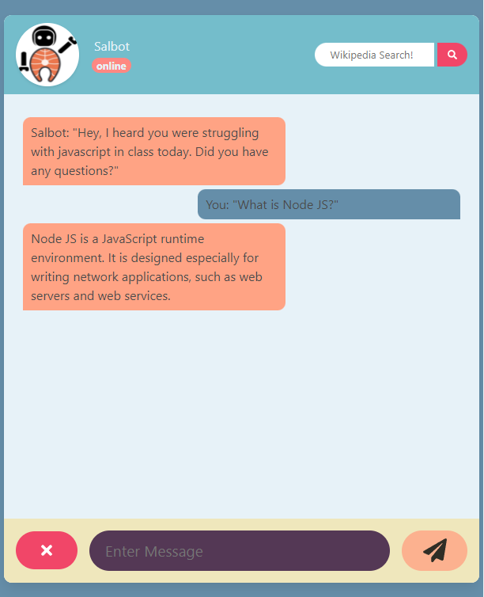
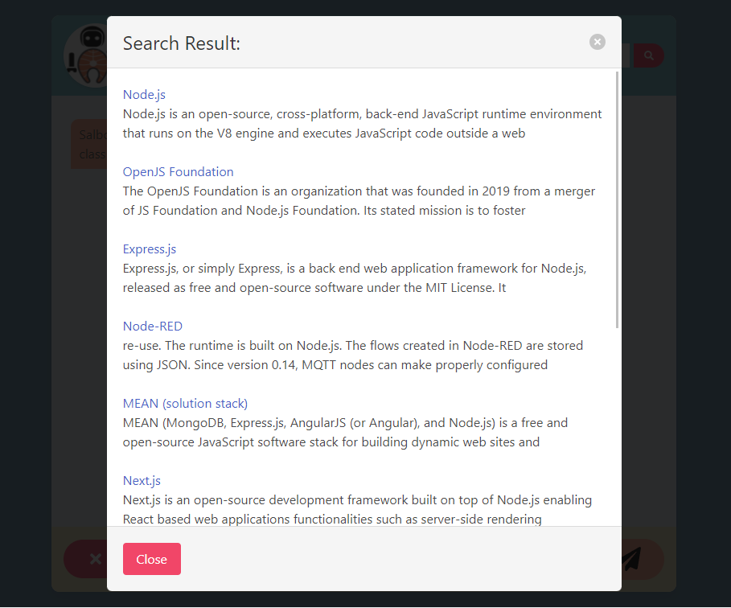
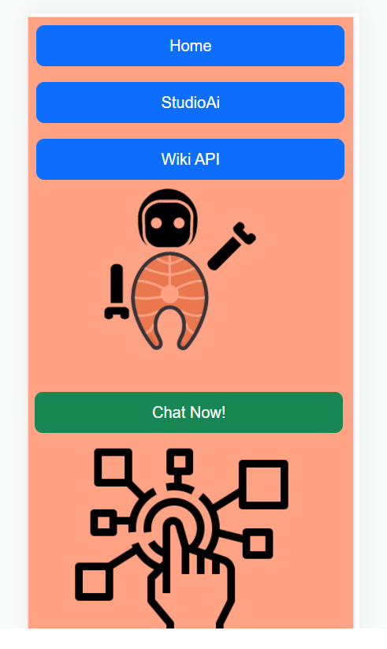

# SalBot

## Description

The project creates a AI chatbot with landing page which will run in the browser and will feature dynamically updated HTML and CSS powered by JavaScript code. It uses AI21 API to associate with AI library. SalBot is an AI tutor that can answer any questions, users just need to type in questions and Salbot will automatically reply. Besides, it uses MediaWiki API that allow users to search anything they want, the results will be displayed in a modal. 


## Technologies Used

This section lists all the major frameworks/libraries used to bootstrap the project. 
* [AI21 studio](https://www.ai21.com/studio)
* [MediaWiki](https://www.mediawiki.org/wiki/API:Main_page)
* [Jquery](https://jquery.com/)
* [Jquery UI](https://jqueryui.com/)
* [Bootstrap](https://getbootstrap.com/)
* [Bulma](https://bulma.io/)
* [Font Awesome](https://fontawesome.com/)


## Acceptance criteria:
```
When: I load the home page.
Then: I'm greeted with a large picture of the Salbot mascot and a list of SalBot features.
When: I click the "chat now" button.
Then: The chatbot.html page is loaded that displays a chatbox between Salbot and the student.
When: I send a message to salbot.
Then: I am presented with salbot's answer to my question in the form of a conversation.
When: I want to search a term I’m not familiar with
Then: I can search for the term using Wikipedia API and be presented the answer in modal format.
```

## Usage

The following images is the sceenshot of web application's appearance and functionality:




## Link

Click [here](https://jollypong.github.io/SalBot/) to the deployed website


## Contributor

The deployment was completed by the following developers:

* Travis: AI21 API
* Alex(Xingzhi Chang): Wiki API 
* Shanchai: Landing Page
* Joe: Chat Page
 
